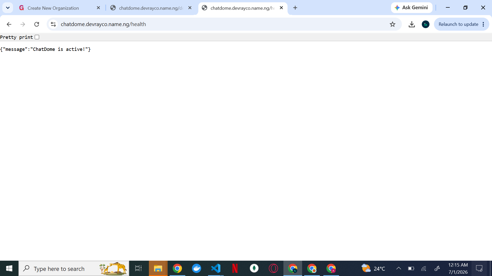

# ChatDome

A real-time chat backend built with FastAPI and PostgreSQL.

Users can register, log in, start direct messages, create group chats, and exchange messages over WebSockets. Authentication is handled with JWTs, data is stored in PostgreSQL, and the application runs in Docker. This repository contains only the backend API.


## Features

* User authentication (register, login, refresh tokens, change password)
* Direct messaging between users
* Group chat creation and management
* Real-time messaging with WebSockets
* Role-based group administration
* Docker and Kubernetes deployment support

## Tech Stack

* FastAPI
* PostgreSQL
* SQLAlchemy (async)
* asyncpg
* JWT (python-jose)
* bcrypt
* Pydantic
* Docker & Kubernetes

## Quick Start

```bash
docker compose -f deployment/docker/docker-compose.yml up --build -d 
```

(or) You can use the *Make* command. make sure you have *Make* installed on your machine, if you don't have it installed, use 
```bash
sudo apt-get update && sudo apt-get install make
```
After installing, hit:
```bash
Make run
```

Once running:

* API: `http://localhost:8000`
* Health Check: `http://localhost:8000/health`
* Docs: `http://localhost:8000/docs`

## Environment Variables

Generate any secret key using:
```bash
make gen-secret
```

Required:

```env
DATABASE_URL=
JWT_SECRET=
POSTGRES_USER=
POSTGRES_PASSWORD=
POSTGRES_DB=
REDIS_URL=
SECRET_KEY= 
PORT=8080
GLITCHTIP_DOMAIN=
DEFAULT_FROM_EMAIL=
EMAIL_URL=consolemail://
ACCOUNT_EMAIL_VERIFICATION=none
GLITCHTIP_DSN=
```

## WebSocket Endpoint

```text
ws://localhost:8000/chat/ws/{conversation_id}?token=<access_token>
```

Clients can send messages in JSON format and receive real-time updates from other participants.

## Deployment

Kubernetes manifests are available in [`deployment/k8s/`](./deployment/k8s) for deploying the API, PostgreSQL, ingress, autoscaling, and related resources.
