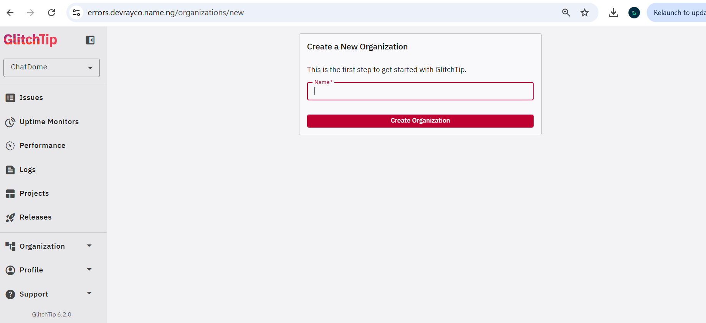

# GlitchTip Setup for ChatDome

Self-hosted error tracking for the ChatDome backend, running alongside the existing Docker Compose stack.


##


## Stack overview

GlitchTip runs as two services sharing the existing Postgres instance plus a new Redis instance:

- `glitchtip-web` - the Django app + UI, serves on port 8080
- `glitchtip-worker` - Celery worker + beat scheduler, handles grouping, notifications, and cleanup
- `redis` - message broker between web and worker

All services run on the existing `chatdome_network` bridge network and resolve each other via Docker's internal DNS using their service names (`postgres`, `redis`, `glitchtip-web`, `backend`).


## .env additions

```env
# glitchtip
REDIS_URL=redis://redis:6379
SECRET_KEY=                          # python -c "import secrets; print(secrets.token_hex(32))"
PORT=8080
GLITCHTIP_DOMAIN=https://errors.yourdomain.com   # replace with real domain in production
DEFAULT_FROM_EMAIL=errors@yourdomain.com
EMAIL_URL=consolemail://              # dev only - emails print to logs instead of sending. Replace with real SMTP in production.

# backend
GLITCHTIP_DSN=http://<public_key>@glitchtip-web:8080/<project_id>
```

## First-time setup

1. Generate a `SECRET_KEY` and add it to `.env`:
   ```bash
   make gen-secret
   ```

2. Bring the stack up:
   ```bash
   make run
   ```

3. Watch `glitchtip-web` logs to confirm migrations completed and the server started:
   ```bash
   make glitchtip-logs
   ```

4. Create a superuser (one-time, interactive):
   ```bash
   make glitchtip-superuser
   ```

5. Visit `http://localhost:8080`, log in, and create an organization (e.g. `ChatDome`).

##


6. Create a project under that organization. Choose **Python** as the platform (FastAPI doesn't have a dedicated SDK option - plain Python covers it).

7. Copy the DSN shown on the project setup page and paste it into `.env` as `GLITCHTIP_DSN`, using `http://` as the scheme (see note above).

8. Recreate the backend to pick up the new env var (`.env` changes require a recreate, not just a restart):
   ```bash
   make recreate
   ```

GlitchTip is Sentry SDK-compatible, so `sentry-sdk` works unmodified.

Hit it to test:

```bash
curl http://localhost:8000/debug-sentry
```

Check `http://localhost:8080/<org-slug>/issues` - a `ZeroDivisionError` should appear within a few seconds. Once confirmed, remove the test route or gate it behind an environment check.

## Makefile reference

```makefile
glitchtip-migrate:
	docker exec chatdome-glitchtip-web ./manage.py migrate
glitchtip-superuser:
	docker exec -it chatdome-glitchtip-web ./manage.py createsuperuser
glitchtip-logs:
	docker logs -f chatdome-glitchtip-web
glitchtip-worker-logs:
	docker logs -f chatdome-glitchtip-worker
glitchtip-shell:
	docker exec -it chatdome-glitchtip-web ./manage.py shell
```

`glitchtip-migrate` is rarely needed manually since migrations run automatically on `glitchtip-web` startup - kept for re-running after image upgrades that add new migrations.
