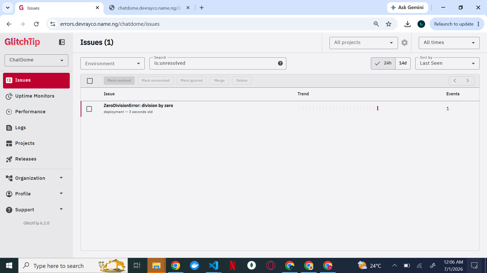

# ChatDome GlitchTip Setup

GlitchTip is a my self-hosted error tracker compatible with the Sentry SDK. This documents shows how it was added to the ChatDome cluster.

>It is exposed at `https://errors.devrayco.name.ng` through the same NLB and Traefik setup everything else uses.

##


## What gets deployed

The Helm chart installs two pods:

- `glitchtip-web` handles the UI, API, and the Celery worker (embedded in the same process)
- `glitchtip-valkey` is a lightweight Redis-compatible broker used internally by the worker

Postgres is not chart-managed. The chart just connects to the existing `postgres` service using a `DATABASE_URL` you provide.

---

## Step 1 - Create the database

The chart won't create the database on an external Postgres instance, so you do it manually first. This job connects to the existing `postgres` service using `chatdome-secrets` and creates a `glitchtip` database if it doesn't exist yet.

```bash
cat > glitchtip-db-init-job.yml << 'EOF'
apiVersion: batch/v1
kind: Job
metadata:
  name: glitchtip-db-init
spec:
  backoffLimit: 3
  template:
    spec:
      restartPolicy: OnFailure
      containers:
        - name: create-glitchtip-db
          image: postgres:16
          envFrom:
            - secretRef:
                name: chatdome-secrets
          command:
            - sh
            - -c
            - |
              export PGPASSWORD="$POSTGRES_PASSWORD"
              EXISTS=$(psql -h postgres -U "$POSTGRES_USER" -d postgres -tAc \
                "SELECT 1 FROM pg_database WHERE datname='glitchtip'")
              if [ "$EXISTS" != "1" ]; then
                psql -h postgres -U "$POSTGRES_USER" -d postgres \
                  -c "CREATE DATABASE glitchtip OWNER $POSTGRES_USER"
                echo "Created glitchtip database"
              else
                echo "glitchtip database already exists, skipping"
              fi
EOF

kubectl apply -f glitchtip-db-init-job.yml
kubectl logs job/glitchtip-db-init
```

Wait for `Created glitchtip database` in the logs before continuing.

---

## Step 2 - Create the secret

```bash
kubectl create secret generic glitchtip-secrets \
  --from-literal=SECRET_KEY="$(python3 -c 'import secrets; print(secrets.token_hex(32))')" \
  --from-literal=DATABASE_URL="postgresql://domeadmin:<password>@postgres:5432/glitchtip"
```

---

## Step 3 - DNS

Add a CNAME in Cloudflare pointing at the NLB.

```
errors.devrayco.name.ng CNAME adf761c11b1144b25a8b22e4e435fab0-3d5d7c6132ae0330.elb.us-east-1.amazonaws.com
```

---

## Step 4 - Install via Helm

```bash
helm repo add glitchtip https://gitlab.com/api/v4/projects/16325141/packages/helm/stable
helm repo update
```

```bash
cat > glitchtip-values.yaml << 'EOF'
glitchtip:
  existingSecret: glitchtip-secrets
  existingSecretKey: SECRET_KEY
  domain: "https://errors.devrayco.name.ng"
  database:
    existingSecret: glitchtip-secrets
    existingSecretKey: DATABASE_URL
  valkey:
    existingSecret: ~

postgresql:
  enabled: false

valkey:
  enabled: true
  auth:
    enabled: false
  primary:
    persistence:
      enabled: false
    resources:
      requests:
        cpu: 50m
        memory: 64Mi
      limits:
        cpu: 250m
        memory: 256Mi

replicaCount: 1

resources:
  requests:
    cpu: 250m
    memory: 512Mi
  limits:
    cpu: 1000m
    memory: 1Gi

ingress:
  enabled: true
  className: traefik
  annotations:
    cert-manager.io/cluster-issuer: "letsencrypt-prod"
    traefik.ingress.kubernetes.io/router.entrypoints: web,websecure
    traefik.ingress.kubernetes.io/router.tls: "true"
  hosts:
    - host: errors.devrayco.name.ng
      paths:
        - path: /
          pathType: Prefix
  tls:
    - secretName: glitchtip-tls-secret
      hosts:
          - errors.devrayco.name.ng
EOF

helm install glitchtip glitchtip/glitchtip -n default -f glitchtip-values.yaml
```

Watch everything come up:

```bash
kubectl get pods -l app.kubernetes.io/instance=glitchtip -w
```

You want both `glitchtip-web` and `glitchtip-valkey` at `1/1 Running`.

---

## Step 5 - First login

Open `https://errors.devrayco.name.ng` and register your admin account. Then:

1. Create an organization
2. Create a project, select Python as the platform
3. GlitchTip gives you a DSN that looks like `https://<key>@errors.devrayco.name.ng/1`

---

## Step 6 - Connect ChatDome

Update `chatdome-secrets` with the DSN and restart the deployment:

```bash
kubectl delete secret chatdome-secrets

kubectl create secret generic chatdome-secrets \
  --from-literal=DATABASE_URL="postgresql+asyncpg://domeadmin:<password>@postgres:5432/dome" \
  --from-literal=POSTGRES_USER="domeadmin" \
  --from-literal=POSTGRES_PASSWORD="<password>" \
  --from-literal=POSTGRES_DB="dome" \
  --from-literal=SECRET_KEY="$(python3 -c 'import secrets; print(secrets.token_hex(32))')" \
  --from-literal=JWT_SECRET="$(python3 -c 'import secrets; print(secrets.token_hex(32))')" \
  --from-literal=PORT="8000" \
  --from-literal=REDIS_URL="redis://glitchtip-valkey:6379" \
  --from-literal=GLITCHTIP_DOMAIN="https://errors.devrayco.name.ng" \
  --from-literal=DEFAULT_FROM_EMAIL="errors@devrayco.name.ng" \
  --from-literal=EMAIL_URL="consolemail://" \
  --from-literal=GLITCHTIP_DSN="<paste-dsn-here>"

kubectl rollout restart deployment/chat-dome-deployment
```

## Upgrading

```bash
helm repo update
helm upgrade glitchtip glitchtip/glitchtip -n default -f glitchtip-values.yaml
```

## Step 7
Hit the /debug-sentry endpoint to test deployment, a "Internal Server Error" will be returned.
After that, head to issues page in https://errors.devrayco.name.ng/chatdome/issues (or whatever your domain might be), a ZeroDivisionError will be displayed.

##


Check the changelog before upgrading since the chart has had breaking schema changes between major versions.

